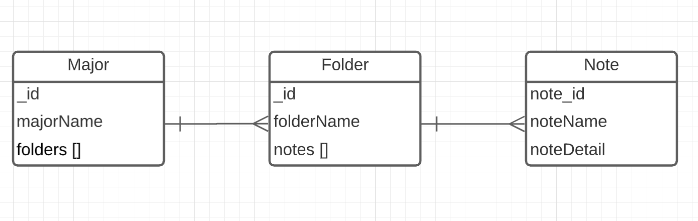

# Notes App (MERN Full Stack)

## Introduction
This app is built using the MERN stack. It's a web application where you can create your own study notes for different majors and all users can see the notes. With this current version, only the admin can create and edit majors, folders and notes.  
There are 3 main features: majors, folders, notes; and each supports create, edit and view. For edit and create, only the admin can access. 

---

## Snapshots
 
 
 
 

---

## Keypoints of Implementaion

### Client Side (React)

- Handle Routing
    - [react-router-dom](https://reactrouter.com/web/guides/quick-start) 
- Http Requests
    - [axios](https://www.npmjs.com/package/axios)
- Verify Authentication
    - react [higher-order component](https://reactjs.org/docs/higher-order-components.html) to wrap the components that need to be protected
    - the protected compoents renderd on the page only when the admin is authenticated 
- Rich Text Editor   
    - [ck classic editor](https://ckeditor.com/docs/ckeditor5/latest/builds/guides/integration/frameworks/react.html) 
    - [dompurify](https://github.com/cure53/DOMPurify) to sanitize html input
        - sanitize before storing the data and before displaying on the page 
    - [dangerouslySetInnerHTML](https://reactjs.org/docs/dom-elements.html) (React's innerHTML version)
- UI Styling
    - [react-bootstrap](https://www.npmjs.com/package/axios)
    - [vanilla bootstrap](https://getbootstrap.com/) 
    - [material-ui](https://material-ui.com/) 
    - [favicon.io](https://favicon.io/favicon-generator/) 

### Server Side (Express, Node.js, MongoDB)

- Routes handling
    - [express](http://expressjs.com/) 
- Admin authentication and authorization 
    - [jwt](https://jwt.io/) (Json Web Token) 
    - [bcrypt](https://www.npmjs.com/package/bcrypt) to store password
- Database connection 
    - [mongoose](https://mongoosejs.com/)
- Data Models
    - Admin
    - Major
    - Folder
    - Note
- Schema Diagram

 
---

## Useful Resources
- [Cross-Origin Resource Sharing](https://developer.mozilla.org/en-US/docs/Web/HTTP/CORS) 
- [React Lifecyle Easy Exaplanation](https://www.w3schools.com/react/react_lifecycle.asp)
- [MongodDB one-to-many Relationship Tutorial](https://bezkoder.com/mongoose-one-to-many-relationship/)
- [How to Build Rich Text Editor](https://blog.logrocket.com/building-rich-text-editors-in-react-using-draft-js-and-react-draft-wysiwyg/)
- [Glassmorphism Adjustment](https://glassmorphism.com/)
- [CSS Gradient](https://cssgradient.io/)